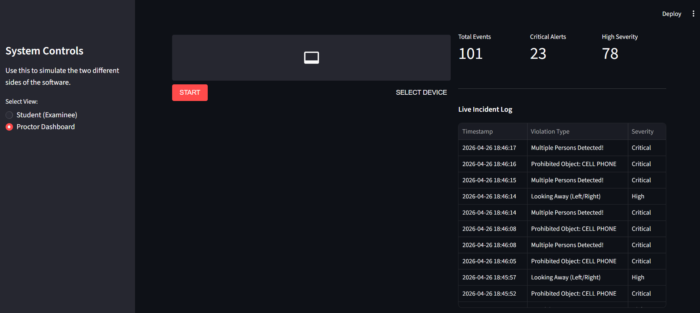

Privacy-Preserving Proctoring System using AI

## 1. Summary
A real-time, fully local AI proctoring application designed to maintain exam integrity while strictly respecting student privacy. Built with Python and Streamlit, this system runs multiple Computer Vision models simultaneously to detect suspicious behavior, log state changes, and provide a live analytics dashboard for proctors.

## 2. Key Features

Privacy-First Processing: Automatically segments and blurs the student's background locally. No video is recorded or sent to the cloud.
Multi-Modal AI Pipeline:
    MediaPipe Face Mesh: Tracks precise eye gaze (iris drifting), head pose (pitch/yaw), and speaking (mouth aspect ratio).
    YOLOv8 Nano: Scans for prohibited items like cell phones.
    Multi-Person Detection: Instantly flags if a second face enters the frame.
Highly Optimized Engine: Uses frame-skipping (processing heavy YOLO inference only every 15 frames) and 2D facial heuristics to ensure a smooth, lag-free webcam feed. 
Smart State-Change Logging: Prevents database spam by only logging the exact timestamp when a user's status transitions from normal to a violation.
Role-Based Architecture: Includes a toggle to switch between a clean "Student View" (webcam only) and an asynchronous "Proctor Dashboard" (live metrics and auto-refreshing violation logs).

## 3. Tech Stack

Frontend/UI:Streamlit, Streamlit-WebRTC
Computer Vision: OpenCV, MediaPipe (Selfie Segmentation & Face Mesh)
Object Detection: Ultralytics YOLOv8
Data Processing: Pandas, Python built-in CSV & Datetime

## 4. Installation & Setup

(1) Clone the repository:
(2) Create a Virtual Environment (Recommended):
(3) Install the required dependencies given in requirements.txt
(4) Run the Application:

Bash
streamlit run proctor_app.py
Note: On the first run, the app will automatically download the lightweight YOLOv8 Nano model (yolov8n.pt).

## 5. How the AI Works
* Gaze Detection: Calculates the ratio of the iris distance to the inner/outer eye corners. If the ratio heavily skews (e.g., < 0.4 or > 0.60), it flags "Suspicious Eye Movement."

* Pitch Ratio: Instead of computationally expensive 3D solving, it measures the vertical distance from the nose to the forehead vs. the nose to the chin to detect if a student is looking down.

* Asynchronous Updates: Uses the @st.fragment decorator to silently refresh the proctor's data table every 2 seconds without reloading the WebRTC video stream.

## 6. Architecture Note: Prototype vs. Production

This repository serves as a local prototype to demonstrate the Computer Vision and multi-threading architecture. Because it is designed to run locally for portfolio demonstration:

(1) Webcam Routing: Both the "Student View" and "Proctor Dashboard" currently route to the local `localhost` webcam. In a production deployment, the WebRTC stream would be transmitted over a network, allowing the proctor to securely monitor a remote client's stream.
(2) Visible Telemetry: AI status texts are currently rendered onto the video frame in both views to visually demonstrate the mathematical tracking (Pitch Ratio, Yaw, Gaze Ratio) for reviewers. In a deployed application, these `cv2.putText` overlays would be stripped from the client-side UI to prevent the examinee from attempting to bypass the system thresholds.

## 7. Sample Image

